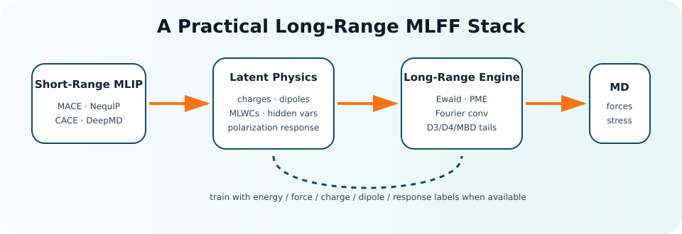

<h1 align="center">🎉 Awesome-ML-Force-Field-Long-Range 🔥</h1>

---

<p align="center">

</p>

<p align="center">


<br>


<br>
<br>
You can click on <b> Watch</b> and <b> Star</b> to get the latest updates at any time.
<br>
<br>
<b> Watch</b> Me ! <b> Watch</b> Me ! <b> Watch</b> Me !
<br>
<b> Star</b> Me ! <b> Star</b> Me ! <b> Star</b> Me !
</p>

---

<details><summary>🎁 >>>>>>>> [English Introduction] <<<<<<<<<< </summary>

> This repository is a focused navigation map for **long-range interactions in machine learning force fields / machine learning interatomic potentials (MLFFs / MLIPs)**.
>
> It tracks papers, code, datasets, and implementation notes for models that go beyond the usual short-range locality assumption.
>
> The list is organized around four recurring design choices:
>
> 🌑 **Explicit electrostatics**: charges, dipoles, charge equilibration, polarization, Ewald/PME, and Wannier-center based models.
>
> 🌒 **Learned global communication**: reciprocal-space message passing, latent Ewald variables, Fourier convolution, global nodes, and nonlocal descriptors.
>
> 🌓 **Dispersion and van der Waals**: D3/D4/MBD-style corrections and datasets for noncovalent interaction learning.
>
> 🌔 **Software integration**: modules that can be attached to DeepMD, CACE, MACE, NequIP, Allegro, CHGNet, SchNetPack, OpenMM, ASE, or LAMMPS workflows.
>
> 🎉 Contributions are welcome. If a long-range MLFF paper, repository, or benchmark is missing, please submit a PR.

</details>

<details><summary>🏆 >>>>>>>> [🧡中文简要介绍💜] <<<<<<<<<< </summary>

<br>

> 本项目专门整理👍**机器学习力场 / 机器学习原子间势中的长程相互作用**👏相关工作。
>
> 这里关注的问题不是普通 MLIP 大而全导航，而是聚焦：短程 cutoff 假设什么时候失效、如何显式或隐式补上长程物理、哪些代码可以直接用于模拟。
>
> 仓库按照以下主线整理：
>
> 🌑 **长程静电**：原子电荷、偶极、QEq、极化、Ewald/PME、Wannier center、Born effective charge。
>
> 🌒 **全局通信机制**：reciprocal-space message passing、Latent Ewald、Fourier convolution、global/relay node、nonlocal descriptor。
>
> 🌓 **色散与范德华**：D3/D4/MBD 修正、非共价相互作用数据集、短程模型 + 显式色散的混合路线。
>
> 🌔 **工程实现**：DeepMD、CACE、MACE、NequIP、Allegro、CHGNet、SchNetPack、OpenMM、ASE、LAMMPS 等生态中的可用模块。
>
> 🎉 欢迎补充遗漏论文、代码、数据集与复现实验。这个列表会持续更新。

</details>

---

<p align="center">
🍦 Long-range physics for practical atomistic machine learning. 🍦
<br>
<br>

</p>

---

## Introduction

Most modern MLFFs decompose the energy into local atomic environments and use a finite cutoff. This works surprisingly well for many bulk and near-equilibrium systems, but it can fail for charged molecules, polar liquids, interfaces, ionic materials, ferroelectrics, heterogeneous catalysis, and dilute electrolyte systems where electrostatics, dispersion, or polarization remain relevant far beyond the cutoff.

This repository collects methods that explicitly address this gap.

### ✨You are welcome to provide work related to long-range ML force fields.✨

If you discover a missing paper, dataset, benchmark, or codebase, please open a PR or issue. The most useful additions include a stable link, a one-sentence motivation, and code availability.

### 🍔 Highlight

<!-- TODO: curate highlights manually. -->

### 🕑 Timeline

<!-- TODO: curate timeline manually. -->

---

## 📚 Table of Contents

- [💙 News](#-news)
- [🧭 Taxonomy](#-taxonomy)
- [📌 Core Papers and Code](#-core-papers-and-code)
- [⚡ Long-Range Electrostatics](#-long-range-electrostatics)
- [🧲 Polarization, Multipoles, and Electric Response](#-polarization-multipoles-and-electric-response)
- [🌫️ Dispersion and Noncovalent Interactions](#️-dispersion-and-noncovalent-interactions)
- [🧪 Datasets and Benchmarks](#-datasets-and-benchmarks)
- [🛠️ Software Ecosystem](#️-software-ecosystem)
- [🧠 Reading Map](#-reading-map)
- [Contributing](#contributing)
- [Cite This Repository](#cite-this-repository)
- [License](#license)
- [Acknowledgements](#acknowledgements)

---

## 💙 News

**[2026/05/01] [V0.1] Initial release.**

- Created a focused navigation list for long-range interactions in MLFFs / MLIPs.
- Added first taxonomy, software links, and dataset links.
- PRs are welcome for missing methods, benchmarks, and reproducibility notes.

---

## 🧭 Taxonomy

| Family | Typical ingredients | Strength | Typical caveat |
|---|---|---|---|
| Charge / dipole learning | Atomic charges, molecular dipoles, charge constraints, QEq | Physically interpretable electrostatics | Needs charge/dipole labels or reliable constraints |
| Wannier-center / electronic-center learning | MLWCs, electronic response variables | Strong for insulating periodic systems | Requires extra electronic-structure labels |
| Ewald / PME augmentation | Explicit reciprocal-space summation | Correct asymptotic periodic electrostatics | Engineering complexity and charge neutrality details |
| Latent reciprocal variables | Hidden charges or latent fields + Ewald/Fourier layers | Can learn from energy/force only | Interpretability and transfer need validation |
| Global message passing | Ewald features, global nodes, Fourier convolution | Adds nonlocal communication to GNNs | May still need physics priors for asymptotics |
| Dispersion correction | D3/D4/MBD or learned dispersion tail | Cheap and robust for vdW | Double-counting if base model already learned it |

---

## 📌 Core Papers and Code

<!-- TODO: curate core papers and code manually. -->

---

## ⚡ Long-Range Electrostatics

<details><summary>Charge, Dipole, and QEq Models</summary>

| Method | Main idea | Notes |
|---|---|---|
| [PhysNet](https://doi.org/10.1021/acs.jctc.9b00181) | Predicts partial charges and dipoles together with energies/forces | Multitask energy/charge learning; predicted charges enter an explicit electrostatic term and dipoles are trained as observables. [Note](notes/PhysNet_Unke_Meuwly_JCTC_2019.mmd) |
| [SpookyNet](https://doi.org/10.1038/s41467-021-27504-0) | Adds electronic degrees of freedom and nonlocal effects | Uses total charge/spin embeddings, nonlocal interactions, and analytic electrostatic/dispersion corrections to handle electronic-state ambiguity and nonlocality. [Note](notes/SpookyNet_Unke_NatComm_2021.mmd) |
| [4G-HDNNP](https://doi.org/10.1038/s41467-020-20427-2) | Neural atomic energy + global charge equilibration | Uses QEq over NN-predicted electronegativities; the resulting global charges feed both long-range electrostatics and short-range atomic networks. [Note](notes/FourGNNP_Ko_Behler_NatComm_2021.mmd) |
| [AIMNet2](https://github.com/isayevlab/aimnetcentral) | Charge-aware neural potential with Ewald/DSF and D3 support in current code | No dedicated AIMNet2 note yet; related notes cover original AIMNet and AIMNet-NSE. [AIMNet SI](notes/AIMNet_Zubatyuk_SciAdv_2019_SI.mmd), [AIMNet-NSE note](notes/AIMNet_NSE_Zubatyuk_NatComm_2021.mmd) |
| [AIMNet-NSE](https://doi.org/10.1038/s41467-021-24904-0) | Neural sum of energies approach with charge prediction | Neural spin-charge equilibration conserves total spin charges by construction, enabling one model across neutral, cationic, anionic, and spin states. [Note](notes/AIMNet_NSE_Zubatyuk_NatComm_2021.mmd) |
| [Variational charge equilibration](https://www.nature.com/articles/s41524-024-01226-5) | Builds long-range electrostatics from short-range predicted quantities | No mmd note in this repository yet. |
| [BAMBOO](https://github.com/bytedance/bamboo) | Electrolyte force-field framework with ML charges and liquid-electrolyte focus | No mmd note in this repository yet. |
| [HIPNN Charge](https://doi.org/10.1021/acs.jpclett.8b00684) | Hierarchical interacting particle neural network with charge prediction | ACA uses HIP-NN to infer partial charges from molecular dipoles; the learned charges transfer to quadrupoles and larger molecules. [Note](notes/HIPNN_Charge_Sifain_JPCL_2018.mmd) |
| [SCFNN](https://doi.org/10.1038/s41467-022-29243-2) | Self-consistent field neural network for charge equilibration | Separates Gaussian-truncated short-range physics from long-range electric-field response; MLWFCs and forces are coupled through a self-consistent loop. [Note](notes/SCFNN_Gao_Remsing_NatComm_2022.mmd) |
| [BpopNN](https://doi.org/10.1021/acs.jctc.0c00217) | Bond-order potential neural network with charge transfer | Treats DFT energy as a function of atom-based electron populations from CDFT; optimizing populations lets electronic terms adapt self-consistently. [Note](notes/BpopNN_Xie_JCTC_2020.mmd) |

</details>

<details><summary>Ewald, PME, Fourier, and Reciprocal-Space Models</summary>

| Method | Main idea | Notes |
|---|---|---|
| [DPLR](https://doi.org/10.1063/5.0083669) | Learns Wannier centers and evaluates long-range electrostatics with Deep Potential | Adds Gaussian charges at ionic sites and MLWC-derived electronic sites to DP; tested on water dimer/slab and NaCl phonons. [Note](notes/Deep_Potential_Long_Range.mmd) |
| [DeepWannier for Dielectric Response](https://doi.org/10.1103/PhysRevB.102.041121) | Learns Wannier centers for dielectric properties | Learns MLWC centers with a symmetry-preserving DNN, then combines with DP to access dielectric response and spectra of insulating systems. [Note](notes/DeepWannier_Dielectric_Zhang_PRB_2020.mmd) |
| [EwaldMP](https://github.com/arthurkosmala/EwaldMP) | Adds Ewald-based long-range message passing to molecular graphs | No mmd note in this repository yet. |
| [LES](https://doi.org/10.1038/s41524-025-01577-7) | Learns latent variables and applies Ewald summation | Predicts latent variables from local descriptors and couples them globally through Ewald summation; benchmarks include charged/polar dimers, molten NaCl, bulk water, and water interfaces. [Note](notes/Latent_Ewald_Summation.mmd) |
| [LES augmentation](https://doi.org/10.1021/acs.jctc.5c01400) | Standalone LES library attached to CACE, MACE, NequIP, Allegro, CHGNet, UMA | Standalone PyTorch LES module for retrofitting short-range MLIPs; can infer electrostatics, polarization, and BECs from energy/force training. [Note](notes/LES_Universal_Augmentation_Long_Range.mmd) |
| [SOG-Net](https://github.com/DuktigYajie/SOG-Net) | Learns sum-of-Gaussians long-range kernels with Fourier convolution | Learns latent variables and sum-of-Gaussians Fourier convolution kernels to cover different long-range decay tails with near-linear NUFFT-based scaling. [Note](notes/SOG-Net.mmd) |
| [Reciprocal Space Neural Network](https://arxiv.org/abs/2211.16684) | Uses reciprocal-space representation to capture long-range interactions | No mmd note in this repository yet. |
| [SCFNN](https://doi.org/10.1038/s41467-022-29243-2) | Self-consistent treatment of long-range electrostatics in neural network potentials | Separates Gaussian-truncated short-range physics from long-range electric-field response; MLWFCs and forces are coupled through a self-consistent loop. [Note](notes/SCFNN_Gao_Remsing_NatComm_2022.mmd) |

</details>

---

## 🧲 Polarization, Multipoles, and Electric Response

| Resource | Why it matters | Notes |
|---|---|---|
| [Machine learning interatomic potential can infer electrical response](https://www.nature.com/articles/s41524-025-01911-z) | Shows that LES-style MLIPs can infer Born effective charges and response properties. | No dedicated mmd note yet; related framework note: [LES augmentation](notes/LES_Universal_Augmentation_Long_Range.mmd). |
| [ANI-2X/AMOEBA](https://doi.org/10.1039/d2sc04815a) | Hybrid DNN/polarizable potential route for biomolecular simulations with long-range effects. | Couples ANI-2X solute interactions with AMOEBA polarizable solvent/environment and PME long-range electrostatics in Deep-HP. [Note](notes/ANI_AMOEBA_Inizan_ChemSci_2023.mmd) |
| [Multipolar electrostatic kriging](https://doi.org/10.1021/acs.jctc.6b00457) | Learns geometry-dependent atomic multipoles for polarizable electrostatics. | Uses kriging to predict QTAIM atomic multipoles for all natural amino acids, including charged variants, and reconstruct electrostatic interaction energies. [Note](notes/AA_Multipole_Kriging_Fletcher_Popelier_JCTC_2016.mmd) |
| [DMFF](https://github.com/deepmodeling/DMFF) | Differentiable molecular force-field ecosystem for polarizable and long-range classical terms. | No mmd note in this repository yet. |
| [OpenMM](https://github.com/openmm/openmm) | Production molecular simulation engine with PME, polarizable models, and custom forces. | No mmd note in this repository yet. |
| [SchNetPack](https://github.com/atomistic-machine-learning/schnetpack) | Atomistic ML toolkit with modules for atomistic properties and extensible model components. | No SchNetPack-specific mmd note yet; related architecture note: [SchNet](notes/SchNet_Schutt_JCP_2018.mmd). |
| [FeNNol / FeNNix](https://github.com/FeNNol-tools/FeNNol) | Force-field-enhanced NNP direction; useful to watch for local + long-range energy decomposition. | Modular JAX library for building force-field-enhanced NNPs, including physics modules such as Coulomb/Ewald terms and charge equilibration. [Note](notes/FENNIX.mmd) |

---

## 🌫️ Dispersion and Noncovalent Interactions

| Resource | Direction | Code / Data |
|---|---|---|
| [DFT-D3](https://www.chemie.uni-bonn.de/grimme/de/software/dft-d3) | Empirical dispersion correction often paired with MLFFs | [dftd3/simple-dftd3](https://github.com/dftd3/simple-dftd3), [tad-dftd3](https://github.com/tad-mctc/tad-dftd3) |
| [DFT-D4](https://www.chemie.uni-bonn.de/grimme/de/software/dft-d4) | Charge-dependent dispersion correction | [dftd4/dftd4](https://github.com/dftd4/dftd4) |
| [DES370K](https://doi.org/10.1038/s41597-021-00833-x) | Large noncovalent interaction dataset | [DES370K data](https://zenodo.org/record/4910158) |
| [S66 / S66x8](https://doi.org/10.1021/ct2002946) | Classic benchmark for noncovalent interactions | Useful for sanity checks |
| [SPICE](https://doi.org/10.1038/s41597-022-01882-6) | Drug-like molecules, dimers, solvated amino acids, ions | [OpenMM/SPICE](https://github.com/openmm/spice-dataset) |

---

## 🧪 Datasets and Benchmarks

| Dataset | Long-range relevance | Link |
|---|---|---|
| SPICE | Molecular dimers, solvated fragments, ions; useful for electrostatics and dispersion | [paper](https://doi.org/10.1038/s41597-022-01882-6), [code/data](https://github.com/openmm/spice-dataset) |
| DES370K | High-quality noncovalent interaction energies for dispersion / H-bond / electrostatics | [paper](https://doi.org/10.1038/s41597-021-00833-x), [data](https://zenodo.org/record/4910158) |
| QM7-X | Off-equilibrium molecules with quantum properties, forces, dipoles | [paper](https://doi.org/10.1038/s41597-020-0473-z) |
| QMugs | Drug-like conformers with quantum properties | [paper](https://doi.org/10.1038/s41597-022-01390-7) |
| Water / ions / interfaces | Critical stress test for electrostatics, dielectric response, and finite-size artifacts | See LES and DPLR benchmark papers |
| Polar crystals / ferroelectrics | Born effective charge and dielectric-response tests | See LES-BEC and related response-property work |

---

## 🛠️ Software Ecosystem

| Project | Use in long-range MLFF workflows |
|---|---|
| [DeepMD-kit](https://github.com/deepmodeling/deepmd-kit) | Deep Potential models, DPLR-style long-range electrostatics, production MD. |
| [CACE](https://github.com/BingqingCheng/cace) | CACE descriptor + LES / long-range modules. |
| [SOG-Net](https://github.com/DuktigYajie/SOG-Net) | Deep-SOG and CACE-SOG implementations. |
| [MACE](https://github.com/ACEsuit/mace) | Strong short-range equivariant baseline; used as host model for long-range augmentation. |
| [NequIP](https://github.com/mir-group/nequip) / [Allegro](https://github.com/mir-group/allegro) | Equivariant short-range baselines; useful for testing long-range add-ons. |
| [CHGNet](https://github.com/CederGroupHub/chgnet) | Charge-informed graph network baseline in materials. |
| [SchNetPack](https://github.com/atomistic-machine-learning/schnetpack) | Modular atomistic ML toolkit with MD integration. |
| [AIMNetCentral](https://github.com/isayevlab/aimnetcentral) | Molecular MLIP toolkit with charges, D3, DSF/Ewald Coulomb, ASE and PySisyphus calculators. |
| [DMFF](https://github.com/deepmodeling/DMFF) | Differentiable molecular force fields and long-range molecular mechanics terms. |
| [ASE](https://gitlab.com/ase/ase) | Glue layer for calculators, datasets, optimizers, and MD. |
| [LAMMPS](https://github.com/lammps/lammps) | Production MD backend; check model-specific pair styles/interfaces. |
| [OpenMM](https://github.com/openmm/openmm) | Production MD engine for PME/dispersion/polarization and ML/MM integration. |

---

## 🧠 Reading Map

**If you are new to the field:**

1. Start with PhysNet and SpookyNet to see how molecular MLFFs incorporate charges, dipoles, and dispersion.
2. Read DPLR for periodic long-range electrostatics with Wannier centers.
3. Read EwaldMP, LES, and SOG-Net for current reciprocal-space / latent-variable strategies.
4. Test on at least one charged, polar, interfacial, or noncovalent dataset; short-range validation alone is not enough.

**If you are building a model:**

1. Decide whether the system needs explicit asymptotic physics, learned nonlocal communication, or a hybrid.
2. Check if required labels are available: charges, dipoles, MLWCs, dielectric response, or only energy/force.
3. Verify extensivity, charge neutrality, PBC convention, force consistency, and energy conservation.
4. Compare against a strong short-range baseline plus D3/D4 before claiming long-range gains.

---

## Contributing

We welcome contributions! Please read [CONTRIBUTING.md](CONTRIBUTING.md) and submit a pull request.

Preferred entry format:

```markdown
- [Paper Title](paper-url) (Venue, Year) - one sentence on long-range relevance. [Code](code-url)
```

---

## Cite This Repository

If you find this repository useful, please consider citing:

```bibtex
@misc{awesome_mlff_long_range_2026,
  title        = {Awesome Machine Learning Force Fields with Long-Range Interactions},
  author       = {ZeHeru and contributors},
  year         = {2026},
  howpublished = {\url{https://github.com/ZeHeru/Awesome-ML-Force-Field-Long-Range}}
}
```

---

## License

This project is licensed under the MIT License - see the [LICENSE](LICENSE) file for details.

---

## Acknowledgements

This list is inspired by the open-source awesome-list culture. Thanks to researchers who release papers, datasets, trained models, and reproducible code for the MLFF community.
