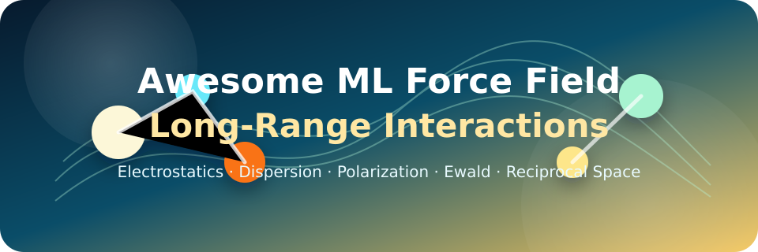

<h1 align="center">🎉 Awesome Machine Learning Force Fields 🔥</h1>

---

<p align="center">

</p>

<p align="center">


<br>


<br>
<br>
<b>🔥 This is a living repository, actively maintained and continuously updated with new papers, datasets, benchmarks, and code releases. 🔥</b>
<br>
<br>
You can click on <b> Watch</b> and <b> Star</b> to get the latest updates at any time.
<br>
<br>
<b> Watch</b> Me ! <b> Watch</b> Me ! <b> Watch</b> Me !
<br>
<b> Star</b> Me ! <b> Star</b> Me ! <b> Star</b> Me !
</p>

---

## 📚 Table of Contents

- [💙 News](#-news)
- [Introduction](#introduction)
- [🧭 Taxonomy](#-taxonomy)
- [🌟 Long-Range Interactions](#-long-range-interactions)
  - [📖 Reviews and Perspectives](#-reviews-and-perspectives-long-range)
  - [🔬 Models and Methods](#-models-and-methods-long-range)
  - [🧪 Datasets](#-datasets-long-range)
  - [🏆 Benchmarks](#-benchmarks-long-range)
- [🔥 Reactive Chemistry](#-reactive-chemistry)
  - [📖 Reviews and Perspectives](#-reviews-and-perspectives-reactive)
  - [🔬 Models and Methods](#-models-and-methods-reactive)
  - [🧪 Datasets](#-datasets-reactive)
  - [🏆 Benchmarks](#-benchmarks-reactive)
- [Contributing](#contributing)
- [Cite This Repository](#cite-this-repository)
- [License](#license)
- [Acknowledgements](#acknowledgements)

---

## 💙 News

**[2026/05/05] [V0.3] Merged long-range and reactive MLFF repositories.**

- Unified two focused repositories into one comprehensive resource
- Reorganized structure: Long-Range Interactions + Reactive Chemistry
- Each theme divided into: Reviews, Models, Datasets, Benchmarks
- Added 14 reactive MLFF entries

**[2026/05/04] [V0.2] Added 7 new papers on long-range interactions.**

- Added Euclidean Fast Attention, LES, SO3LR, CHGNet, M3GNet
- Added BioFragment Database and DES370K datasets

**[2026/05/01] [V0.1] Initial release.**

- Created focused navigation lists for long-range and reactive MLFFs
- Added first taxonomy, dataset links, and core papers

---

## Introduction

Modern machine learning force fields face two critical challenges:

**Long-Range Interactions**: Most MLFFs use finite cutoffs and local decomposition, which works well for many systems but fails for charged molecules, polar liquids, interfaces, ionic materials, and systems where electrostatics, dispersion, or polarization remain relevant beyond the cutoff.

**Reactive Chemistry**: Models trained only on equilibrium conformers may have excellent force errors near minima but fail along bond-breaking pathways, transition states, ionic/radical regions, or high-temperature reactive trajectories.

This repository collects methods, datasets, and benchmarks that explicitly address these two challenges.

### ✨You are welcome to contribute.✨

If you discover missing work, please submit a pull request or issue. Include a stable paper link, code/data link when available, and a one-sentence explanation.

---

## 🧭 Taxonomy

### Long-Range Interaction Methods

| Family | Typical ingredients | Strength | Typical caveat |
|---|---|---|---|
| Charge / dipole learning | Atomic charges, molecular dipoles, charge constraints, QEq | Physically interpretable electrostatics | Needs charge/dipole labels or reliable constraints |
| Wannier-center / electronic-center learning | MLWCs, electronic response variables | Strong for insulating periodic systems | Requires extra electronic-structure labels |
| Ewald / PME augmentation | Explicit reciprocal-space summation | Correct asymptotic periodic electrostatics | Engineering complexity and charge neutrality details |
| Latent reciprocal variables | Hidden charges or latent fields + Ewald/Fourier layers | Can learn from energy/force only | Interpretability and transfer need validation |
| Global message passing | Ewald features, global nodes, Fourier convolution | Adds nonlocal communication to GNNs | May still need physics priors for asymptotics |
| Dispersion correction | D3/D4/MBD or learned dispersion tail | Cheap and robust for vdW | Double-counting if base model already learned it |

### Reactive Chemistry Methods

| Family | Typical data | Main task | Typical caveat |
|---|---|---|---|
| Reaction-path datasets | NEB/IRC/GSM paths, TSs, reactants/products | Train MLIPs that see bond breaking/forming | Chemistry scope may be narrow |
| Nanoreactor / active learning | High-T/P reactive MD + uncertainty selection | General condensed-phase reactivity | Needs robust uncertainty and filtering |
| TS/Hessian datasets | Hessians, saddle points, TS guesses | Faster TS optimization and validation | Second derivatives are expensive labels |
| General reactive MLIPs | ANI-1xnr, AIMNet2-rxn, open-shell variants | Out-of-the-box organic reaction modeling | Element/spin/charge scope must be respected |
| Catalysis MLIPs | Organometallic or surface reaction data | Mechanism and catalyst screening | Transfer outside ligand/metal scope is hard |
| ML-assisted path search | ML-NEB, BNEB, ML Hessians, Sella | Faster barriers and reaction networks | Product identity and path correctness must be checked |

---

## 🌟 Long-Range Interactions

---

### 📖 Reviews and Perspectives (Long-Range)

| Resource | Focus | Summary |
|---|---|---|
| [Neural network potentials for chemistry: concepts, applications and prospects](https://pubs.rsc.org/en/content/articlelanding/2023/dd/d2dd00102k) (Digital Discovery, 2023) | Comprehensive review of NN-based PESs for chemistry | Covers theoretical background, NN architectures, descriptors, PES construction workflows, knowledge transfer, applications in spectroscopy and dynamics. |
| [Neural network potentials: a concise overview of methods](https://doi.org/10.1146/annurev-physchem-082720-034254) (Annu. Rev. Phys. Chem., 2022) | Concise overview of NNP methods across four generations | Systematic classification from first-generation to fourth-generation potentials with nonlocal charge transfer. |
| [Four generations of high-dimensional neural network potentials](https://doi.org/10.1021/acs.chemrev.0c00868) (Chem. Rev., 2021) | Comprehensive review of HDNNP evolution including long-range treatment | Reviews four generations: from low-dimensional systems to high-dimensional local models, then adding long-range electrostatics and nonlocal charge transfer. |
| [Machine learning potentials for extended systems: a perspective](https://doi.org/10.1140/epjb/s10051-021-00156-1) (Eur. Phys. J. B, 2021) | Perspective on ML potentials for materials with long-range interactions | Discusses locality exploitation, long-range electrostatics, and non-local charge transfer in ML potentials for extended systems. |
| [Long-range electrostatics made easier](https://doi.org/10.1063/5.0316886) (J. Chem. Phys., 2026) | Perspective on LES framework design principles | Distills two key principles: use Coulomb functional with environment-dependent charges, and avoid training on ambiguous DFT partial charges. |
| [When short-range models fall short](https://doi.org/10.1063/5.0031215) (J. Chem. Phys., 2021) | Analysis of long-range interaction necessity in ML models | Demonstrates that while local representations suffice for condensed phases, short-range ML models fail for cluster and vapor phases. |
| [General-purpose ML potentials with nonlocal charge transfer](https://doi.org/10.1021/acs.accounts.0c00689) (Acc. Chem. Res., 2021) | Account of fourth-generation NNPs capturing nonlocal phenomena | Overview of machine learning potentials that can describe long-range charge transfer and electronic effects. |

---

### 🔬 Models and Methods (Long-Range)

<details><summary>Charge, Dipole, and QEq Models</summary>

| Method | Main idea | Summary |
|---|---|---|
| [PhysNet](https://doi.org/10.1021/acs.jctc.9b00181) (J. Chem. Theory Comput., 2019) | Predicts partial charges and dipoles together with energies/forces | Multitask energy/charge learning; predicted charges enter an explicit electrostatic term and dipoles are trained as observables. |
| [SpookyNet](https://doi.org/10.1038/s41467-021-27504-0) (Nat. Commun., 2021) | Adds electronic degrees of freedom and nonlocal effects | Uses total charge/spin embeddings, nonlocal interactions, and analytic electrostatic/dispersion corrections. |
| [4G-HDNNP](https://doi.org/10.1038/s41467-020-20427-2) (Nat. Commun., 2021) | Neural atomic energy + global charge equilibration | Uses QEq over NN-predicted electronegativities; the resulting global charges feed both long-range electrostatics and short-range atomic networks. |
| [AIMNet2](https://github.com/isayevlab/aimnetcentral) | Charge-aware neural potential with Ewald/DSF and D3 support | Current AIMNetCentral models include spin/charge-aware variants and long-range electrostatics support. |
| [AIMNet-NSE](https://doi.org/10.1038/s41467-021-24904-0) (Nat. Commun., 2021) | Neural sum of energies approach with charge prediction | Neural spin-charge equilibration conserves total spin charges by construction. |
| [BAMBOO](https://doi.org/10.1038/s42256-025-01009-7) (Nat. Mach. Intell., 2025) | Electrolyte force-field framework with ML charges | Graph equivariant transformer MLFF for liquid electrolytes with semi-local, QEq electrostatic, and D3 dispersion terms. |
| [HIPNN Charge](https://doi.org/10.1021/acs.jpclett.8b00684) (J. Phys. Chem. Lett., 2018) | Hierarchical interacting particle neural network with charge prediction | Uses HIP-NN to infer partial charges from molecular dipoles. |
| [SCFNN](https://doi.org/10.1038/s41467-022-29243-2) (Nat. Commun., 2022) | Self-consistent field neural network for charge equilibration | Separates Gaussian-truncated short-range physics from long-range electric-field response. |
| [BpopNN](https://doi.org/10.1021/acs.jctc.0c00217) (J. Chem. Theory Comput., 2020) | Bond-order potential neural network with charge transfer | Treats DFT energy as a function of atom-based electron populations from CDFT. |
| [CENT](https://doi.org/10.1103/PhysRevB.92.045131) (Phys. Rev. B, 2015) | Charge equilibration via neural network technique | Learns environment-dependent electronegativities via NN to predict atomic charges through charge equilibration. |

</details>

<details><summary>Ewald, PME, Fourier, and Reciprocal-Space Models</summary>

| Method | Main idea | Summary |
|---|---|---|
| [DPLR](https://doi.org/10.1063/5.0083669) (J. Chem. Phys., 2022) | Learns Wannier centers and evaluates long-range electrostatics with Deep Potential | Adds Gaussian charges at ionic sites and MLWC-derived electronic sites to DP. |
| [DeepWannier for Dielectric Response](https://doi.org/10.1103/PhysRevB.102.041121) (Phys. Rev. B, 2020) | Learns Wannier centers for dielectric properties | Learns MLWC centers with a symmetry-preserving DNN. |
| [EwaldMP](https://github.com/arthurkosmala/EwaldMP) | Adds Ewald-based long-range message passing to molecular graphs | Reference implementation is available from the linked repository. |
| [LES](https://doi.org/10.1038/s41524-025-01577-7) (npj Comput. Mater., 2025) | Learns latent variables and applies Ewald summation | Predicts latent variables from local descriptors and couples them globally through Ewald summation. |
| [LES augmentation](https://doi.org/10.1021/acs.jctc.5c01400) (J. Chem. Theory Comput., 2026) | Standalone LES library attached to CACE, MACE, NequIP, Allegro, CHGNet, UMA | Standalone PyTorch LES module for retrofitting short-range MLIPs. |
| [SOG-Net](https://arxiv.org/abs/2502.04668) (arXiv, 2025) | Learns sum-of-Gaussians long-range kernels with Fourier convolution | Learns latent variables and sum-of-Gaussians Fourier convolution kernels. |
| [CACE-SOG](https://doi.org/10.1063/5.0303312) (J. Chem. Phys., 2026) | Couples CACE descriptor with SOG-Net for long-range interactions | Integrates Cartesian atomic cluster expansion with sum-of-Gaussians neural network. |
| [Euclidean Fast Attention](https://doi.org/10.1038/s42256-026-01195-y) (Nat. Mach. Intell., 2026) | Linear-scaling attention mechanism for global atomic representations | Introduces Euclidean rotary positional encoding with spherical integration. |
| [CHGNet](https://doi.org/10.1038/s42256-023-00716-3) (Nat. Mach. Intell., 2023) | Charge-informed graph neural network with magnetic moments | Pretrained universal neural network potential that explicitly incorporates magnetic moments. |
| [M3GNet](https://doi.org/10.1038/s43588-022-00349-3) (Nat. Comput. Sci., 2022) | Universal graph deep learning IAP with three-body interactions | Graph neural network with explicit three-body interactions trained on Materials Project data. |
| [Incorporating long-range physics](https://doi.org/10.1063/1.5128375) (J. Chem. Phys., 2019) | Introduces nonlocal representations for long-range electrostatics | Proposes O(3)-equivariant nonlocal features with electrostatic-like asymptotic behavior. |

</details>

<details><summary>Polarization, Multipoles, and Electric Response</summary>

| Resource | Why it matters | Summary |
|---|---|---|
| [Machine learning interatomic potential can infer electrical response](https://www.nature.com/articles/s41524-025-01911-z) (npj Comput. Mater., 2025) | Shows that LES-style MLIPs can infer Born effective charges and response properties | Extracts polarization and BEC tensors from LES trained only on energies and forces. |
| [Foundation MLIP with polarizable long-range](https://doi.org/10.1038/s41467-025-65496-3) (Nat. Commun., 2025) | Foundation model integrating polarizable long-range physics with equivariant GNN | Uses polarizable charge equilibration optimizing electrostatic energies directly. |
| [ANI-2X/AMOEBA](https://doi.org/10.1039/d2sc04815a) (Chem. Sci., 2023) | Hybrid DNN/polarizable potential route for biomolecular simulations | Couples ANI-2X solute interactions with AMOEBA polarizable solvent/environment. |
| [Multipolar electrostatic kriging](https://doi.org/10.1021/acs.jctc.6b00457) (J. Chem. Theory Comput., 2016) | Learns geometry-dependent atomic multipoles for polarizable electrostatics | Uses kriging to predict QTAIM atomic multipoles for all natural amino acids. |
| [SchNetPack](https://doi.org/10.1021/acs.jcim.9b00181) (J. Chem. Inf. Model., 2019) | Atomistic ML toolkit with modules for atomistic properties | SchNetPack framework and the 2.0 rewrite provide extensible tooling for MLFF workflows. |
| [FeNNol / FeNNix](https://doi.org/10.1063/5.0217688) (J. Chem. Phys., 2024) | Force-field-enhanced NNP direction | Modular JAX library for building force-field-enhanced NNPs. |

</details>

<details><summary>Dispersion and Noncovalent Interactions</summary>

| Resource | Direction | Code / Data |
|---|---|---|
| [DFT-D3](https://www.chemie.uni-bonn.de/grimme/de/software/dft-d3) | Empirical dispersion correction often paired with MLFFs | [dftd3/simple-dftd3](https://github.com/dftd3/simple-dftd3), [tad-dftd3](https://github.com/tad-mctc/tad-dftd3) |
| [DFT-D4](https://www.chemie.uni-bonn.de/grimme/de/software/dft-d4) | Charge-dependent dispersion correction | [dftd4/dftd4](https://github.com/dftd4/dftd4) |
| [MBD](https://doi.org/10.1103/PhysRevLett.108.236402) (Phys. Rev. Lett., 2012) | Many-body dispersion method with self-consistent screening | Accurate treatment of frequency-dependent polarizability and many-body vdW energy. |
| [vdW in water](https://doi.org/10.1073/pnas.1602375113) (PNAS, 2016) | Demonstrates essential role of vdW forces in water properties | Shows that vdW interactions are crucial for water's density maximum. |
| [SO3LR](https://doi.org/10.1021/jacs.4c14713) (J. Am. Chem. Soc., 2025) | Combines SO3krates NN with universal pairwise force fields | Integrates semilocal SO3krates with ZBL repulsion, electrostatics, and universal vdW dispersion. |

</details>

---

### 🧪 Datasets (Long-Range)

| Dataset | Long-range relevance | Link |
|---|---|---|
| **OC25** | 7.8M+ solid-liquid interface structures with explicit solvents and ions; critical for electrolyte effects and long-range electrostatics at charged interfaces | [arXiv](https://arxiv.org/abs/2509.17862), [data](https://huggingface.co/facebook/OC25) |
| **OMC25** | 27M+ molecular crystal structures with PBE+D3 dispersion correction; diverse intermolecular interactions | [Sci. Data 2026](https://doi.org/10.1038/s41597-026-06628-2), [data](https://huggingface.co/datasets/facebook/OMC25) |
| **BioFragment Database** | Comprehensive database of noncovalent interactions in biological systems | [paper](https://doi.org/10.1063/1.4974896) |
| **DES370K** | Large noncovalent interaction dataset with 370K dimers | [paper](https://doi.org/10.1038/s41597-021-00833-x), [data](https://zenodo.org/record/4910158) |
| **SPICE** | Molecular dimers, solvated fragments, ions; useful for electrostatics and dispersion | [paper](https://doi.org/10.1038/s41597-022-01882-6), [code/data](https://github.com/openmm/spice-dataset) |
| **S66 / S66x8** | Classic benchmark for noncovalent interactions | [paper](https://doi.org/10.1021/ct2002946) |
| **QM7-X** | Off-equilibrium molecules with quantum properties, forces, dipoles | [paper](https://doi.org/10.1038/s41597-020-0473-z) |
| **QMugs** | Drug-like conformers with quantum properties | [paper](https://doi.org/10.1038/s41597-022-01390-7) |

---

### 🏆 Benchmarks (Long-Range)

| Benchmark | Description | Links |
|---|---|---|
| **MLIP Arena v1** | Benchmark platform evaluating MLIPs on physics awareness (PECs, EOS), chemical reactivity, and thermodynamic properties | [arXiv v1](https://arxiv.org/abs/2509.20630v1), [code](https://github.com/atomind-ai/mlip-arena), [leaderboard](https://huggingface.co/spaces/atomind/mlip-arena) |
| **MLIP Arena v2** | Extended version with MD stability under extreme conditions, distribution shift robustness, and extended case studies | [NeurIPS 2025](https://neurips.cc/virtual/2025/poster/121648), [arXiv v2](https://arxiv.org/abs/2509.20630v2) |

---
## 🔥 Reactive Chemistry

---

### 📖 Reviews and Perspectives (Reactive)

| Resource | Focus | Summary |
|---|---|---|
| [Machine learning of reactive potentials](https://doi.org/10.1146/annurev-physchem-062123-024417) (Annu. Rev. Phys. Chem., 2024) | Comprehensive review of ML potentials for reactive chemistry | Covers reactive data generation, active learning, transition state search, and applications in combustion and catalysis. |
| [Reactive machine learning interatomic potentials for chemistry and materials science](https://doi.org/10.1038/s43588-024-00746-5) (Nat. Comput. Sci., 2024) | Perspective on reactive MLIPs for chemistry and materials | Discusses challenges in training data, model architectures, and validation for reactive systems. |
| [Machine learning force fields](https://doi.org/10.1021/acs.chemrev.0c01111) (Chem. Rev., 2021) | Broad MLFF review; useful background for reactive MLIPs | Comprehensive overview of MLFF methods, training strategies, and applications. |
| [Neural network reactive force field for C/H/N/O systems](https://doi.org/10.1021/acs.jpca.0c05992) (J. Phys. Chem. A, 2020) | Early neural network reactive force field for CHNO chemistry | Demonstrates feasibility of NN-based reactive potentials for organic systems. |

---

### 🔬 Models and Methods (Reactive)

<details><summary>General Reactive ML Potentials</summary>

| Model | Chemistry scope | Summary |
|---|---|---|
| [ANI-1xnr](https://github.com/atomistic-ml/ani-1xnr) (Nat. Chem., 2024) | CHNO condensed-phase reactive chemistry | Validated on combustion, carbon nucleation, graphene ring formation, biofuel additives, glycine formation. |
| [AIMNet2-rxn](https://huggingface.co/isayevlab/aimnet2-rxn) (ChemRxiv, 2025) | H/C/N/O closed-shell organic reaction modeling | Designed for TS, NEB, IRC, and reaction-coordinate accuracy. |
| [AIMNet2-NSE](https://github.com/isayevlab/aimnetcentral) | Open-shell / radical chemistry | Current AIMNetCentral model family includes spin/charge-aware variants. |
| [AIMNet2-Pd](https://doi.org/10.26434/chemrxiv-2025-n36r6) (ChemRxiv, 2025) | Pd cross-coupling reactions | Targets oxidative addition, transmetalation, reductive elimination, and catalyst screening. |
| [NewtonNet](https://github.com/THGLab/NewtonNet) (Nat. Commun., 2024) | Organic TS optimization with ML Hessians | Differentiable model used for analytical Hessian workflows. |

</details>

<details><summary>Equivariant MLIPs for Reactive Systems</summary>

| Model | Application | Summary |
|---|---|---|
| [MACE for organometallic TS](https://doi.org/10.1021/acs.jctc.4c00500) (J. Chem. Theory Comput., 2024) | Organometallic transition states and ligand effects | Demonstrates MACE's capability for modeling transition metal catalysis. |
| [MACE for drug BDE prediction](https://doi.org/10.1021/acs.jctc.4c00294) (J. Chem. Theory Comput., 2024) | Bond dissociation energies in drug-like molecules | Shows MACE can predict bond breaking energies relevant to drug metabolism. |
| [MACE for liquid electrolytes](https://doi.org/10.1021/acs.jctc.4c01307) (J. Chem. Theory Comput., 2025) | Transferability in reactive liquid electrolyte systems | Evaluates MACE transferability for electrochemical systems. |
| [NequIP for Diels-Alder dynamics](https://doi.org/10.1039/D2CP02978B) (Phys. Chem. Chem. Phys., 2022) | Diels-Alder reaction dynamics | Early demonstration of equivariant NNP for organic reaction dynamics. |
| [Allegro for methane activation](https://doi.org/10.1021/acs.jpclett.4c00562) (J. Phys. Chem. Lett., 2024) | Methane C-H activation on Ni(111) surface | Shows Allegro's capability for surface catalysis reactions. |
| [Allegro for photocatalytic CO2](https://doi.org/10.1021/acs.jpcc.4c00437) (J. Phys. Chem. C, 2024) | CuPt/TiO2 photocatalytic CO2 reduction | Demonstrates Allegro for complex photocatalytic systems. |
| [Dandelion with NequIP](https://doi.org/10.1002/advs.202404369) (Adv. Sci., 2025) | Reaction sampling and mechanism discovery | Combines NequIP with enhanced sampling for reaction discovery. |

</details>

<details><summary>Active Learning and Workflow Tools</summary>

| Tool / Paper | Role in reactive MLFF workflows | Summary |
|---|---|---|
| [Active learning metadynamics](https://doi.org/10.1039/D5DD00271K) (Digital Discovery, 2026) | Combines active learning with metadynamics for reactive MLIP training | Efficient exploration of reactive pathways with uncertainty-driven sampling. |
| [NeuralNEB](https://gitlab.com/matschreiner/neuralneb) | Uses ML potentials for NEB path search on Transition1x-style reactions | PaiNN + Transition1x for fast NEB reaction paths. |
| [Sella](https://github.com/zadorlab/sella) | ASE transition-state optimizer | Integrates with ML calculators and Hessians. |
| [PySisyphus](https://github.com/eljost/pysisyphus) | Reaction path, IRC, and TS optimization framework | Supported by AIMNetCentral extras. |
| [QuAcc](https://github.com/Quantum-Accelerators/quacc) | High-throughput atomistic workflows | Including TS / IRC recipes. |
| [ASE NEB](https://wiki.fysik.dtu.dk/ase/ase/neb.html) | Standard Python NEB interface | For ML and QM calculators. |
| [DeepMD-kit](https://github.com/deepmodeling/deepmd-kit) | Production MLIP training and MD | Often used with DP-GEN for reactive active-learning workflows. |
| [DP-GEN](https://github.com/deepmodeling/dpgen) | Concurrent learning / active-learning workflow | For DP models. |

</details>

<details><summary>Classical Reactive Force Fields (Reference)</summary>

| Method | Summary |
|---|---|
| [ReaxFF for hydrocarbon oxidation](https://doi.org/10.1021/jp709896w) (J. Phys. Chem. A, 2008) | Classical reactive force field for combustion chemistry; useful baseline for ML reactive potentials. |

</details>

---

### 🧪 Datasets (Reactive)

<details><summary>Reaction Paths, Transition States, and Barriers</summary>

| Dataset | Scope | Why it matters | Links |
|---|---|---|---|
| [Transition1x](https://doi.org/10.1038/s41597-022-01870-w) (Sci. Data, 2022) | Organic CHNO reactions, NEB paths, DFT energies/forces | 9.6M DFT calculations around 10k organic reaction pathways | [GitLab](https://gitlab.com/matschreiner/Transition1x) |
| [RGD1](https://doi.org/10.1038/s41597-023-02043-z) (Sci. Data, 2023) | 176k+ organic reactions with validated TSs and barriers | Large and diverse TS/reaction-property benchmark | [GitHub](https://github.com/zhaoqy1996/RGD1), [Zenodo](https://doi.org/10.5281/zenodo.7618731) |
| [HORM](https://www.nature.com/articles/s41597-025-06350-5) (Sci. Data, 2026) | Hessians from QM9, Transition1x, and RGD1-related geometries | Enables ML Hessian and TS optimizer research | [GitHub](https://github.com/deepprinciple/HORM/releases/tag/v1.0) |
| [Grambow reaction dataset / RDB7](https://pubs.acs.org/doi/10.1021/acs.jctc.0c00568) (J. Chem. Theory Comput., 2020) | Small organic reaction barriers and TSs | Common benchmark for barrier prediction and TS search | |
| [BH9 / barrier-height benchmarks](https://doi.org/10.1021/acs.jctc.1c00694) (J. Chem. Theory Comput., 2021) | High-accuracy barrier-height references | Useful for validating reaction energetics | |

</details>

<details><summary>Reactive Active Learning and Condensed-Phase Data</summary>

| Dataset / Model | Scope | Why it matters | Links |
|---|---|---|---|
| [ANI-1xnr](https://doi.org/10.1038/s41557-023-01427-3) (Nat. Chem., 2024) | CHNO condensed-phase nanoreactor active learning | Demonstrates broad reactive MD without system-specific retraining | [GitHub](https://github.com/atomistic-ml/ani-1xnr) |
| [ANI-1x / ANI-1ccx](https://github.com/aiqm/torchani) | Off-equilibrium organic conformations | Useful baseline, but not sufficient alone for transition-state regions | [GitHub](https://github.com/aiqm/torchani) |
| [Open Catalyst Project](https://github.com/FAIR-Chem/fairchem) | Adsorbate-catalyst structures and relaxations | Surface reaction / catalysis-adjacent MLIP ecosystem | [GitHub](https://github.com/FAIR-Chem/fairchem) |
| [OMol25](https://arxiv.org/abs/2505.08762) (arXiv, 2025) | Open molecular dataset and models for chemical space | Useful large-scale molecular baseline; check reaction coverage per task | |

</details>

---

### 🏆 Benchmarks (Reactive)

| Benchmark | Description | Links |
|---|---|---|
| **Transition1x validation set** | Held-out reaction pathways from Transition1x dataset | [GitLab](https://gitlab.com/matschreiner/Transition1x) |
| **RGD1 test set** | Held-out reactions with validated transition states and barriers | [GitHub](https://github.com/zhaoqy1996/RGD1) |
| **HORM Hessian benchmark** | Molecular Hessian accuracy for reactive geometries | [GitHub](https://github.com/deepprinciple/HORM) |
| **Barrier height benchmarks** | BH9 and related high-accuracy barrier references | Various sources |

---

## 🛠️ Software Ecosystem

| Project | Use in MLFF workflows |
|---|---|
| [AIMNetCentral](https://github.com/isayevlab/aimnetcentral) | AIMNet2 calculators, reaction models, ASE/PySisyphus/Sella extras, Hessian support |
| [TorchANI](https://github.com/aiqm/torchani) | ANI model family implementation and baseline molecular NNPs |
| [DeepMD-kit](https://github.com/deepmodeling/deepmd-kit) | Production MLIP training and MD; works with active learning ecosystems |
| [DP-GEN](https://github.com/deepmodeling/dpgen) | Concurrent learning / active-learning workflow for DP models |
| [MACE](https://github.com/ACEsuit/mace) | Equivariant MLIP framework for custom datasets |
| [NequIP](https://github.com/mir-group/nequip) | Equivariant GNN MLIP framework |
| [Allegro](https://github.com/mir-group/allegro) | Scalable equivariant MLIP architecture |
| [SchNetPack](https://github.com/atomistic-machine-learning/schnetpack) | Atomistic ML toolkit with MD and property prediction workflows |
| [TorchMD-Net](https://github.com/torchmd/torchmd-net) | Molecular ML potentials and simulation tooling |
| [ASE](https://gitlab.com/ase/ase) | NEB, calculators, optimizers, MD, file IO |
| [Sella](https://github.com/zadorlab/sella) | Transition-state optimization |
| [PySisyphus](https://github.com/eljost/pysisyphus) | IRC, TS optimization, reaction paths |
| [KinBot](https://github.com/zadorlab/KinBot) | Automated gas-phase reaction discovery and TS guess generation |
| [FAIR-Chem](https://github.com/FAIR-Chem/fairchem) | Open Catalyst and atomistic ML models for catalysis/materials |

---

## 🧠 Reading Map

### If you are new to long-range interactions:

1. Start with **PhysNet** and **SpookyNet** to see how molecular MLFFs incorporate charges, dipoles, and dispersion
2. Read **DPLR** for periodic long-range electrostatics with Wannier centers
3. Read **LES** and **SOG-Net** for current reciprocal-space / latent-variable strategies
4. Test on at least one charged, polar, interfacial, or noncovalent dataset

### If you are new to reactive chemistry:

1. Start with **ANI-1xnr** to see how active learning captures condensed-phase reactivity
2. Read **AIMNet2-rxn** for transition-state and reaction-path modeling
3. Explore **Transition1x** and **RGD1** datasets to understand reactive data requirements
4. Test on held-out reactions and verify barrier accuracy, not just force RMSE

### If you are building a model:

**For long-range:**
1. Decide whether the system needs explicit asymptotic physics, learned nonlocal communication, or a hybrid
2. Check if required labels are available: charges, dipoles, MLWCs, dielectric response, or only energy/force
3. Verify extensivity, charge neutrality, PBC convention, force consistency, and energy conservation
4. Compare against a strong short-range baseline plus D3/D4 before claiming long-range gains

**For reactive:**
1. Ensure training distribution covers bond-breaking/forming geometries
2. Check element/charge/spin scope: does the model support radicals, ions, metals needed by your system?
3. Validate barrier accuracy and reaction energies against QM on held-out reactions
4. Verify reactant/product graph matching and IRC/NEB connectivity, not only force RMSE
5. Use ensembles or active-learning indicators for out-of-domain structures

---

## ✅ Validation Checklist

### Long-Range Systems

- [ ] Test on charged, polar, or interfacial systems beyond training distribution
- [ ] Verify correct asymptotic electrostatic behavior (1/r decay)
- [ ] Check energy conservation in MD simulations
- [ ] Compare against short-range baseline + D3/D4 correction
- [ ] Validate on noncovalent interaction benchmarks (S66, DES370K)
- [ ] Test finite-size effects and PBC convergence

### Reactive Systems

- [ ] Coverage: are bond-breaking/forming geometries in the training distribution?
- [ ] Element/charge/spin scope: does the model support radicals, ions, metals, solvents needed?
- [ ] Barrier accuracy: compare activation energies and reaction energies against QM on held-out reactions
- [ ] Path identity: verify reactant/product graph matching and IRC/NEB connectivity
- [ ] Conservation: confirm energy-conserving forces for MD and stable trajectories
- [ ] Uncertainty: use ensembles or active-learning indicators for out-of-domain structures
- [ ] Negative controls: test near-equilibrium-only models to quantify the gain from reactive data
- [ ] Reoptimization: if ML finds a TS, reoptimize or single-point check with QM for critical claims

---

## Contributing

We welcome contributions! Please read [CONTRIBUTING.md](CONTRIBUTING.md) and submit a pull request.

Preferred entry format:

```markdown
- [Paper Title](paper-url) (Venue, Year) - one sentence on relevance. [Code](code-url) [Data](data-url)
```

---

## Cite This Repository

If you find this repository useful, please consider citing:

```bibtex
@misc{awesome_ml_force_fields_2026,
  title        = {Awesome Machine Learning Force Fields: Long-Range Interactions and Reactive Chemistry},
  author       = {ZeHeru and contributors},
  year         = {2026},
  howpublished = {\url{https://github.com/ZeHeru/Awesome-ML-Force-Field-Long-Range}}
}
```

---

## License

This project is licensed under the MIT License - see the [LICENSE](LICENSE) file for details.

---

## Acknowledgements

This list is inspired by the open-source awesome-list culture. Thanks to researchers who release papers, datasets, trained models, and reproducible code for the MLFF community.
